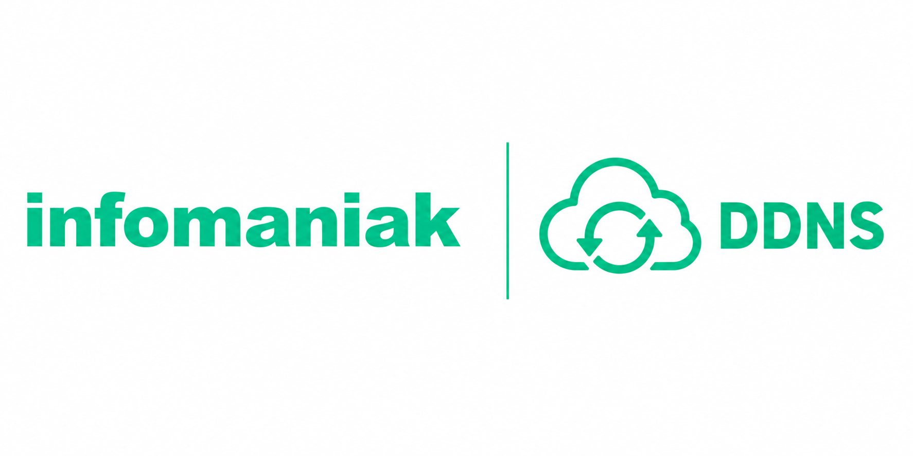

# Infomaniak DynDNS — Home Assistant Integration



[](https://github.com/hacs/integration)
[](https://github.com/cy-bertrand/Infomaniak-dyndns-ha/actions/workflows/hacs.yml)
[](https://github.com/cy-bertrand/Infomaniak-dyndns-ha/actions/workflows/hassfest.yml)

> Français | [English](#english)

Mise à jour automatique de votre enregistrement DNS dynamique (DDNS/DynDNS) Infomaniak depuis Home Assistant.  
Supporte la détection automatique de l'IP WAN, une IP fixe, ou la lecture depuis une entité HA.

## Installation

###  via HACS - Dépôt custom (méthode conseillée)

1. Dans HA : **HACS** → **Intégrations** → bouton **⋮** → **Dépôts personnalisés**
2. URL : `https://github.com/cy-bertrand/Infomaniak-dyndns-ha`
3. Catégorie : **Intégration** → **AJOUTER**
4. Installez **Infomaniak DynDNS** → Redémarrez HA

### Manuelle

Copiez le dossier `custom_components/infomaniak_ddns/` dans `<config>/custom_components/` puis redémarrez HA.

---

## Configuration

**Paramètres → Appareils et services → Ajouter une intégration → Infomaniak DynDNS**

### Paramètres

| Champ | Description | Défaut |
|---|---|---|
| **URL de mise à jour** | URL API DDNS Infomaniak | `https://infomaniak.com/nic/update` |
| **Nom d'hôte** | FQDN DDNS (ex: `home.mondomaine.com`) | — |
| **Nom d'utilisateur** | Login DDNS dédié (**pas** le login admin) | — |
| **Mot de passe** | Mot de passe DDNS dédié (**pas** le mot de passe admin) | — |
| **Intervalle** | Fréquence de mise à jour en minutes | `15` |
| **Source IP** | Voir tableau ci-dessous | Auto |

### Modes de source IP

| Mode | Comportement |
|---|---|
| **Auto — IP WAN (recommandé)** | Infomaniak détecte automatiquement l'IP source de la requête = l'IP WAN de votre accès internet |
| **IP fixe** | Envoie une IPv4 spécifique (`&myip=x.x.x.x`) |
| **Entité HA** | Lit l'état d'un capteur HA (ex: `sensor.ip_wan`) à chaque mise à jour |

> ⚠️ En cas d'entité indisponible ou d'IP invalide, l'intégration bascule automatiquement en mode auto.

---

## Entités créées

| Entité | États | Description |
|---|---|---|
| `sensor.infomaniak_ddns_<hostname>_status` | `updated` / `unchanged` / `error` / `unknown` | Résultat de la dernière mise à jour |
| `sensor.infomaniak_ddns_<hostname>_ip` | IPv4 | Dernière IP enregistrée |

### Attributs de `_status`
- `hostname`, `last_response`, `last_error`, `ip_source`, `ip_mode`, `update_count`, `update_interval_minutes`

---

## Prérequis Infomaniak

1. Domaine géré chez Infomaniak
2. **Manager Infomaniak → votre domaine → DNS → DNS Dynamique**
3. Créer un enregistrement avec un **login/mot de passe DDNS dédié**
4. Utiliser ces identifiants dans l'intégration (≠ identifiants admin)

📖 [Documentation Infomaniak DDNS](https://faq.infomaniak.com/2357)

---

## Réponses API

| Réponse | Signification | Statut |
|---|---|---|
| `good <ip>` | IP mise à jour | `updated` |
| `nochg <ip>` | IP inchangée | `unchanged` |
| `badauth` | Identifiants incorrects | `error` |
| `nohost` | Hôte inconnu | `error` |
| `notfqdn` | FQDN invalide | `error` |
| `abuse` | Trop de requêtes | `error` |
| `911` | Erreur serveur Infomaniak | `error` |

---

## Exemple d'automation

```yaml
automation:
  - alias: "Alerte DDNS en erreur"
    trigger:
      - platform: state
        entity_id: sensor.infomaniak_ddns_home_mondomaine_com_status
        to: "error"
    action:
      - service: notify.mobile_app
        data:
          title: "⚠️ DDNS Infomaniak"
          message: >
            Erreur : {{ state_attr('sensor.infomaniak_ddns_home_mondomaine_com_status', 'last_error') }}
```

---
---

### English

> [Français](#) | English

# Infomaniak DynDNS — Home Assistant Integration


Automatically update your Infomaniak Dynamic DNS (DDNS/DynDNS) record from Home Assistant.  
Supports automatic WAN IP detection, a static IP address, or reading the IP from a Home Assistant entity.

---

## Installation

### Via HACS — Custom Repository (recommended)

1. In HA: **HACS** → **Integrations** → **⋮** button → **Custom repositories**
2. URL: `https://github.com/cy-bertrand/Infomaniak-dyndns-ha`
3. Category: **Integration** → **ADD**
4. Install **Infomaniak DynDNS** → Restart HA

### Manual

Copy the `custom_components/infomaniak_ddns/` folder into `<config>/custom_components/`, then restart HA.

---

## Configuration

**Settings → Devices & Services → Add Integration → Infomaniak DynDNS**

### Parameters

| Field | Description | Default |
|---|---|---|
| **Update URL** | Infomaniak DDNS API URL | `https://infomaniak.com/nic/update` |
| **Hostname** | DDNS FQDN (e.g. `home.mydomain.com`) | — |
| **Username** | Dedicated DDNS login (**not** the admin login) | — |
| **Password** | Dedicated DDNS password (**not** the admin password) | — |
| **Interval** | Update frequency in minutes | `15` |
| **IP Source** | See table below | Auto |

### IP Source Modes

| Mode | Behavior |
|---|---|
| **Auto — WAN IP (recommended)** | Infomaniak automatically detects the source IP of the request = the WAN IP of your internet connection |
| **Static IP** | Sends a specific IPv4 address (`&myip=x.x.x.x`) |
| **HA Entity** | Reads the state of a HA sensor (e.g. `sensor.wan_ip`) on each update |

> ⚠️ If the entity is unavailable or the IP is invalid, the integration automatically falls back to auto mode.

---

## Created Entities

| Entity | States | Description |
|---|---|---|
| `sensor.infomaniak_ddns_<hostname>_status` | `updated` / `unchanged` / `error` / `unknown` | Result of the last update |
| `sensor.infomaniak_ddns_<hostname>_ip` | IPv4 | Last registered IP address |

### Attributes of `_status`
- `hostname`, `last_response`, `last_error`, `ip_source`, `ip_mode`, `update_count`, `update_interval_minutes`

---

## Infomaniak Prerequisites

1. A domain managed at Infomaniak
2. **Infomaniak Manager → your domain → DNS → Dynamic DNS**
3. Create a record with a **dedicated DDNS login/password**
4. Use these credentials in the integration (≠ admin credentials)

📖 [Infomaniak DDNS Documentation](https://www.infomaniak.com/en/support/faq/2357/discover-dyndns-with-an-infomaniak-domain)

---

## API Responses

| Response | Meaning | Status |
|---|---|---|
| `good <ip>` | IP successfully updated | `updated` |
| `nochg <ip>` | IP unchanged, no update needed | `unchanged` |
| `badauth` | Invalid credentials | `error` |
| `nohost` | Unknown hostname | `error` |
| `notfqdn` | Invalid FQDN | `error` |
| `abuse` | Too many requests | `error` |
| `911` | Infomaniak server error | `error` |

---

## Automation Example

```yaml
automation:
  - alias: "Alert on DDNS error"
    trigger:
      - platform: state
        entity_id: sensor.infomaniak_ddns_home_mydomain_com_status
        to: "error"
    action:
      - service: notify.mobile_app
        data:
          title: "⚠️ Infomaniak DDNS"
          message: >
            Error: {{ state_attr('sensor.infomaniak_ddns_home_mydomain_com_status', 'last_error') }}
```

