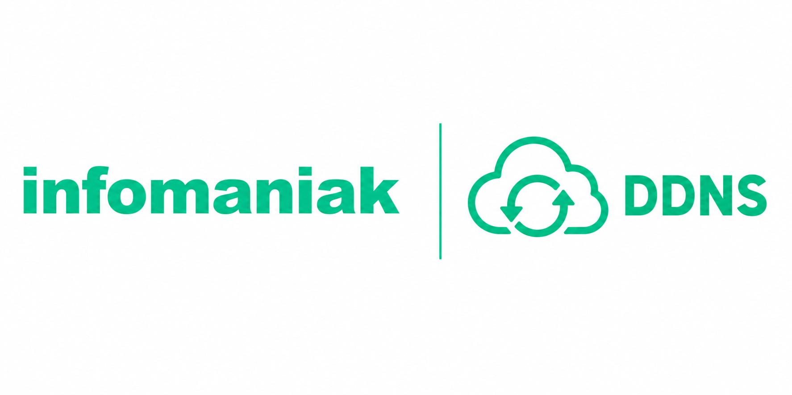

# Infomaniak DynDNS — Home Assistant Integration



[](https://github.com/hacs/integration)
[](https://github.com/cy-bertrand/Infomaniak-dyndns-ha/actions/workflows/hacs.yml)
[](https://github.com/cy-bertrand/Infomaniak-dyndns-ha/actions/workflows/hassfest.yml)

<a href="https://www.buymeacoffee.com/cybertrand" target="_blank"></a>

> Français | [English](#english)

Mise à jour automatique de votre enregistrement DNS dynamique (DDNS/DynDNS) Infomaniak depuis Home Assistant.  
Supporte la détection automatique de l'IP WAN, une IP fixe, ou la lecture depuis une entité HA.

Afin d'éviter le spamming du service DDNS inutile et de permettre une mise à jour rapide d'un changement de l'IP, activation, en option, d'une vérification périodique via des services d'URL publiques de détection de l'IP WAN avec mise à jour du DDNS en cas de détection de changement.

## Installation

###  via HACS (méthode conseillée)

[](https://my.home-assistant.io/redirect/hacs_repository/?owner=cy-bertrand&repository=Infomaniak-dyndns-ha&category=integration)

Dans HACS, chercher "Infomaniak DynDNS"
→ Installez
→ Redémarrez HA
→ Paramètres > Appareil > Ajouter une intégration > Informaniak DynDNS

###  via HACS - Dépôt custom

1. Dans HA : **HACS** → **Intégrations** → bouton **⋮** → **Dépôts personnalisés**
2. URL : `https://github.com/cy-bertrand/Infomaniak-dyndns-ha`
3. Catégorie : **Intégration** → **AJOUTER**
4. Installez **Infomaniak DynDNS** → Redémarrez HA → Paramètres > Appareil > Ajouter une intégration > Informaniak DynDNS

### Manuelle

Copiez le dossier `custom_components/infomaniak_ddns/` dans `<config>/custom_components/` puis redémarrez HA.

---

## Configuration

**Paramètres → Appareils et services → Ajouter une intégration → Infomaniak DynDNS**

### Paramètres

| Champ | Description | Défaut |
|---|---|---|
| **URL de mise à jour** | URL API DDNS Infomaniak | `https://infomaniak.com/nic/update` |
| **Nom d'hôte** | FQDN DDNS (ex: `home.mondomaine.com`) | — |
| **Nom d'utilisateur** | Login DDNS dédié (**pas** le login admin) | — |
| **Mot de passe** | Mot de passe DDNS dédié (**pas** le mot de passe admin) | — |
| **Intervalle** | Fréquence de mise à jour en minutes | `15` |
| **Source IP** | Voir tableau ci-dessous | Auto |
| **Fast detect option** | Service de détection rapide de changement d'IP WAN | — |
| **Fast detect URL(s)** | - URL(s) de services publique de détection d'IP WAN | — |
| **Fast detect intervalle** | Fréquence d'appel aux URL(s) publiques de détection de IP WAN, en secondes, avec rotation entre les URL sélectionnées | `15` |

### Modes de source IP

| Mode | Comportement |
|---|---|
| **Auto — IP WAN (recommandé)** | Infomaniak détecte automatiquement l'IP source de la requête = l'IP WAN de votre accès internet |
| **IP fixe** | Envoie une IPv4 spécifique (`&myip=x.x.x.x`) |
| **Entité HA** | Lit l'état d'un capteur HA (ex: `sensor.ip_wan`) à chaque mise à jour |

> ⚠️ En cas d'entité indisponible ou d'IP invalide, l'intégration bascule automatiquement en mode auto.

### Fast detection option

8 services prédéfinis (ifconfig.me, icanhazip.com, ipify.org, ident.me, ipecho.net, AWS checkip, ipinfo.io, seeip.org), cochables individuellement dans l'écran d'options.
L'utilisateur peut aussi ajouter ses propres URLs (une par ligne).
Le pool est parcouru en round-robin entre les services sélectionnées avec repli automatique sur le service suivant en cas d'échec/timeout (5s) pour éviter de spammer un seul fournisseur.
L'intervalle d'appel peut être définit entre 15 et 3600 secondes.

---

## Entités créées

| Entité | États | Description |
|---|---|---|
| `sensor.infomaniak_ddns_<hostname>_status` | `updated` / `unchanged` / `error` / `unknown` | Résultat de la dernière mise à jour |
| `sensor.infomaniak_ddns_<hostname>_ip` | IPv4 | Dernière IP enregistrée |

### Attributs
- Attributs de `_status`: `hostname`, `last_response`, `last_error`, `ip_source`, `ip_mode`, `update_count`, `check_count`, `update_url`, `update_interval_minutes`, `fast_detection_enabled`, `fast_detection_interval_seconds`, `ip_services_pool_size`, `last_ip_service`
- Attributs de `_ip`: `ip_source`, `ip_mode`, `last_known_wan_ip_fast_check`, `last_ip_service`.

---

## Service

Un service est disponible pour forcer manuellement une mise à jour DDNS, sans attendre le cycle périodique :

| Service | Description |
|---|---|
| `infomaniak_ddns.update` | Force une mise à jour DDNS immédiate |

Données optionnelles :
- `hostname` : FQDN à mettre à jour. Si omis, **toutes** les entrées configurées sont mises à jour.

### Exemple

```yaml
action:
  - service: infomaniak_ddns.update

# ou, pour une entrée précise :
action:
  - service: infomaniak_ddns.update
    data:
      hostname: home.mondomaine.com
```

---

## Prérequis Infomaniak

1. Domaine géré chez Infomaniak
2. **Manager Infomaniak → votre domaine → DNS → DNS Dynamique**
3. Créer un enregistrement avec un **login/mot de passe DDNS dédié**
4. Utiliser ces identifiants dans l'intégration (≠ identifiants admin)

📖 [Documentation Infomaniak DDNS](https://faq.infomaniak.com/2357)

---

## Réponses API

| Réponse | Signification | Statut |
|---|---|---|
| `good <ip>` | IP mise à jour | `updated` |
| `nochg <ip>` | IP inchangée | `unchanged` |
| `badauth` | Identifiants incorrects | `error` |
| `nohost` | Hôte inconnu | `error` |
| `notfqdn` | FQDN invalide | `error` |
| `abuse` | Trop de requêtes | `error` |
| `911` | Erreur serveur Infomaniak | `error` |

---

## Exemple d'automation

```yaml
automation:
  - alias: "Alerte DDNS en erreur"
    trigger:
      - platform: state
        entity_id: sensor.infomaniak_ddns_home_mondomaine_com_status
        to: "error"
    action:
      - service: notify.mobile_app
        data:
          title: "⚠️ DDNS Infomaniak"
          message: >
            Erreur : {{ state_attr('sensor.infomaniak_ddns_home_mondomaine_com_status', 'last_error') }}
```

---
---

### English
<a href="https://www.buymeacoffee.com/cybertrand" target="_blank"></a>

> [Français](#) | English

# Infomaniak DynDNS — Home Assistant Integration


Automatically update your Infomaniak Dynamic DNS (DDNS/DynDNS) record from Home Assistant.  
Supports automatic WAN IP detection, a static IP address, or reading the IP from a Home Assistant entity.

---

## Installation

###  via HACS (recommended)

[](https://my.home-assistant.io/redirect/hacs_repository/?owner=cy-bertrand&repository=Infomaniak-dyndns-ha&category=integration)

In the **HACS** search for "Infomaniak DynDNS"
→ Install
→ Restart HA
→ Settings > Devices > Add Integration > Informaniak DynDNS

### Via HACS — Custom Repository

1. In HA: **HACS** → **Integrations** → **⋮** button → **Custom repositories**
2. URL: `https://github.com/cy-bertrand/Infomaniak-dyndns-ha`
3. Category: **Integration** → **ADD**
4. Install **Infomaniak DynDNS** → Restart HA

### Manual

Copy the `custom_components/infomaniak_ddns/` folder into `<config>/custom_components/`, then restart HA.

---

## Configuration

**Settings → Devices & Services → Add Integration → Infomaniak DynDNS**

### Parameters

| Field | Description | Default |
|---|---|---|
| **Update URL** | Infomaniak DDNS API URL | `https://infomaniak.com/nic/update` |
| **Hostname** | DDNS FQDN (e.g. `home.mydomain.com`) | — |
| **Username** | Dedicated DDNS login (**not** the admin login) | — |
| **Password** | Dedicated DDNS password (**not** the admin password) | — |
| **Interval** | Update frequency in minutes | `15` |
| **IP Source** | See table below | Auto |
| **Fast detect option** | Fast dection of WAN IP Change | — |
| **Fast detect URL(s)** | URL(s) of publics services to detect the WAN IP | — |
| **Fast detect interval** | Interval of call to the public services URL(s) for IP WAN detection, in secondes | `15` |

### IP Source Modes

| Mode | Behavior |
|---|---|
| **Auto — WAN IP (recommended)** | Infomaniak automatically detects the source IP of the request = the WAN IP of your internet connection |
| **Static IP** | Sends a specific IPv4 address (`&myip=x.x.x.x`) |
| **HA Entity** | Reads the state of a HA sensor (e.g. `sensor.wan_ip`) on each update |

> ⚠️ If the entity is unavailable or the IP is invalid, the integration automatically falls back to auto mode.

### Fast detection option

8 Pre-determined public services (ifconfig.me, icanhazip.com, ipify.org, ident.me, ipecho.net, AWS checkip, ipinfo.io, seeip.org), independantly selectables.
The user can also add its own URLs (one per line).
The pool is rotated in round-robin between the selected services with automatic transfer to next service in case of timeou (5s) this to avoid to spam one specific server.
The check interval can be defined between 15 and 3600 seconds.

---

## Created Entities

| Entity | States | Description |
|---|---|---|
| `sensor.infomaniak_ddns_<hostname>_status` | `updated` / `unchanged` / `error` / `unknown` | Result of the last update |
| `sensor.infomaniak_ddns_<hostname>_ip` | IPv4 | Last registered IP address |

### Attributes
- `_status`: `hostname`, `last_response`, `last_error`, `ip_source`, `ip_mode`, `update_count`, `check_count`, `update_url`, `update_interval_minutes`, `fast_detection_enabled`, `fast_detection_interval_seconds`, `ip_services_pool_size`, `last_ip_service`
- `_ip`: `ip_source`, `ip_mode`, `last_known_wan_ip_fast_check`, `last_ip_service`.

---

## Service

A service is available to force a DDNS update manually, without waiting for the periodic cycle:

| Service | Description |
|---|---|
| `infomaniak_ddns.update` | Force an immediate DDNS update |

Optional data:
- `hostname`: FQDN to update. If omitted, **all** configured entries are updated.

### Example

```yaml
action:
  - service: infomaniak_ddns.update

# or, for a specific entry:
action:
  - service: infomaniak_ddns.update
    data:
      hostname: home.mydomain.com
```

---

## Infomaniak Prerequisites

1. A domain managed at Infomaniak
2. **Infomaniak Manager → your domain → DNS → Dynamic DNS**
3. Create a record with a **dedicated DDNS login/password**
4. Use these credentials in the integration (≠ admin credentials)

📖 [Infomaniak DDNS Documentation](https://www.infomaniak.com/en/support/faq/2357/discover-dyndns-with-an-infomaniak-domain)

---

## API Responses

| Response | Meaning | Status |
|---|---|---|
| `good <ip>` | IP successfully updated | `updated` |
| `nochg <ip>` | IP unchanged, no update needed | `unchanged` |
| `badauth` | Invalid credentials | `error` |
| `nohost` | Unknown hostname | `error` |
| `notfqdn` | Invalid FQDN | `error` |
| `abuse` | Too many requests | `error` |
| `911` | Infomaniak server error | `error` |

---

## Automation Example

```yaml
automation:
  - alias: "Alert on DDNS error"
    trigger:
      - platform: state
        entity_id: sensor.infomaniak_ddns_home_mydomain_com_status
        to: "error"
    action:
      - service: notify.mobile_app
        data:
          title: "⚠️ Infomaniak DDNS"
          message: >
            Error: {{ state_attr('sensor.infomaniak_ddns_home_mydomain_com_status', 'last_error') }}
```

